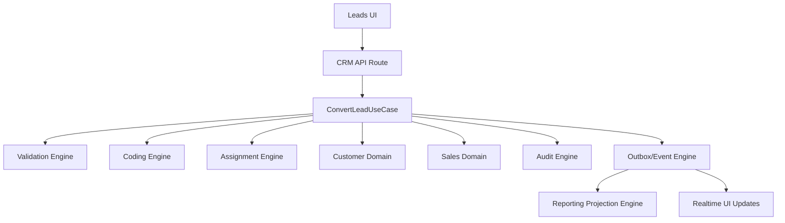

# Nexus CRM Canonical Architecture

Date: 2026-05-19

## Principle

The UI is organized by user workflow. Business logic is organized by domain ownership.

Frontend routes can remain feature-oriented because users think in screens: leads, contacts, accounts, deals, quotes, cadences, reports, settings. Backend logic must not be screen-oriented. It must live in use cases and engines that express the business action being performed.

## Canonical Domains

### Identity Domain

Owns authentication, sessions, tenants, users, roles, permissions, SSO, MFA, profile, data ownership, and access policy.

Current primary service:

- `services/auth-service`

### Customer Domain

Owns customer master data: accounts, contacts, companies, customer hierarchy, consent, customer documents, customer deduplication, customer field history, customer lifecycle and archival.

Current implementation sources:

- `services/crm-service/src/services/accounts.service.ts`
- `services/crm-service/src/services/contacts.service.ts`
- `services/accounts-service`
- `services/contacts-service`
- `services/metadata-service`
- `services/data-service`

Target ownership:

- CRM-service remains the compatibility API during migration.
- Customer domain use cases become canonical.
- Standalone accounts/contacts services are data or read-model services unless promoted to domain owners.

### Sales Domain

Owns leads, lead conversion, deals, pipeline stages, deal transitions, assignment, routing, forecast signals, sales activities, cadences, notes, and sales playbooks.

Current implementation sources:

- `services/crm-service/src/services/leads.service.ts`
- `services/crm-service/src/services/deals.service.ts`
- `services/leads-service`
- `services/deals-service`
- `services/cadence-service`
- `services/activities-service`
- `services/notes-service`
- `services/territory-service`
- `services/planning-service`

Target ownership:

- Sales use cases orchestrate lead/deal workflows.
- Pipeline transitions, assignment, SLA, and conversion call shared engines.
- Legacy service routes become thin adapters or data services.

### Commercial Domain

Owns RFQ, CPQ, quote, quote revision, DRQ, commercial approval, quote template, quote document, expiry, e-sign, order conversion, invoices where linked to quote/order lifecycle, tax/currency/price book references.

Current implementation sources:

- `services/finance-service`
- `services/quotes-service`
- `services/document-service`
- `services/approval-service`
- `services/crm-service` for deal linkage

Target ownership:

- Finance/commercial use cases own CPQ and quote lifecycle.
- Approval, documents, and outbox are engines called by commercial use cases.

### Engagement Domain

Owns communication channels, inbox, email sync, WhatsApp/Telegram, templates, sequences, notifications, and external integrations.

Current implementation sources:

- `services/comm-service`
- `services/email-sync-service`
- `services/integration-service`
- `services/notification-service`
- `services/chatbot-service`

Target ownership:

- Engagement use cases connect communication events to customer and sales timelines.

### Reporting Domain

Owns read models, analytics, reports, dashboards, snapshots, projections, search, and export views.

Current implementation sources:

- `services/reporting-service`
- `services/analytics-service`
- `services/search-service`
- `services/data-service`

Target ownership:

- Reporting consumes domain events and read models.
- Reporting never owns transactional business logic.

## Canonical Engines

Engines are shared business infrastructure. They should be called by domain use cases, not copied into routes.

- Validation Engine: required fields, low-code validation policies, transition guards.
- Coding Engine: admin-controlled reference numbers for accounts, contacts, leads, deals, quotes, products, orders, documents.
- Approval Engine: approval policies, hierarchy, escalation, DRQ/quote/deal/account approval workflows.
- Workflow Engine: low-code triggers, actions, scheduled jobs, SLA actions.
- Assignment Engine: owner routing, territory routing, reassignment, load balancing.
- Deduplication Engine: duplicate detection, merge policy, survivorship.
- Audit Engine: immutable user/system action log and field history.
- Outbox/Event Engine: domain event publication, idempotency, replay, projection.
- Document Engine: templates, render, export, signatures, attachments.
- Import/Export Engine: module import, validation, mapping, export, rollback.
- Reporting Projection Engine: read-model updates from domain events.

## Target Request Flow

Example: lead conversion.

## Route Rule

Routes are controllers only. A route may:

- authenticate
- authorize
- parse input
- call one use case or domain service
- serialize the response

A route must not:

- duplicate validation logic
- perform multi-entity orchestration
- write directly to tables for business workflows
- publish events without the domain use case owning the business result

## Compatibility Rule

Existing frontend and public API paths should stay stable until replacement paths are proven.

During migration:

- keep compatibility routes
- route them to canonical use cases
- mark duplicate standalone APIs as data/internal prefixes
- delete old paths only after tests and callers prove no dependency remains

## Phase Roadmap

### Phase 1: Cleanup And Inventory

Clean obsolete artifacts, map service ownership, stabilize builds, and define canonical architecture.

### Phase 2: Domain Core Package

Create shared domain primitives:

- `DomainResult`
- `DomainError`
- `BusinessUseCase`
- `DomainEvent`
- `AuditContext`
- `EngineContext`
- use-case test helpers

### Phase 3: Customer And Sales Use Cases

Move highest-risk workflows under canonical use cases:

- convert lead
- create/update/archive account
- create/update/archive contact
- move deal stage
- bulk update records
- import/export customer records

### Phase 4: Commercial Use Cases

Move CPQ and quote workflows under canonical use cases:

- create RFQ
- create quote from RFQ/deal
- submit DRQ
- approve/reject quote and DRQ
- render/export quote template
- expire quote
- convert quote to order

### Phase 5: Event And Reporting Projections

Make outbox events the nervous system for timelines, reporting, realtime UI, search, and audit.

### Phase 6: Delete Compatibility Paths

Remove duplicate route/service code after all callers move to canonical use cases.

