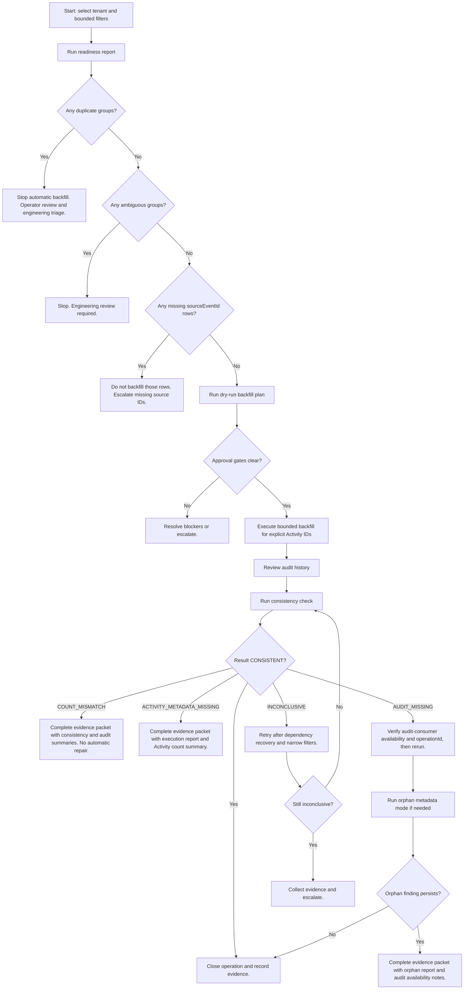

# Finance Timeline Backfill Consistency Operator Runbook

## Purpose

This runbook helps operators interpret finance timeline idempotency, historical Activity metadata backfill, audit history, consistency, and orphan metadata findings. It is for safe inspection, dry-run planning, bounded approved metadata backfill, and escalation. It is not a repair workflow.

## Ownership Boundaries

| Area | Owner | Operator Rule |
|---|---|---|
| Activity timeline metadata | `crm-service` | Inspect through CRM internal finance-timeline endpoints. Mutate only through the approved backfill executor. |
| Durable audit history | `audit-consumer` | Read through the internal audit route or existing admin audit page. Do not edit audit records. |
| Finance and CPQ aggregates | `finance-service` | Never mutate through CRM, audit, projections, SQL repair, or replay tooling. |
| Admin audit UI/BFF | `apps/web` | Browser reads only sanitized audit records. Service tokens remain server-side. |

The finance timeline is a CRM Activity projection. Projections are not authoritative finance truth. Finance aggregates remain owned by finance-service.

## Available Internal Tools

| Tool | Endpoint or Surface | Owner | Use |
|---|---|---|---|
| Readiness report | `GET /api/v1/internal/finance-timeline/idempotency-readiness` | crm-service | Inspect hardened rows, eligible historical rows, duplicates, ambiguous groups, and missing source IDs. |
| Dry-run backfill plan | `POST /api/v1/internal/finance-timeline/idempotency-backfill-plan` | crm-service | Produce a dry-run plan, approval gates, counts, and `planHash`. |
| Backfill executor | `POST /api/v1/internal/finance-timeline/idempotency-backfill-execute` | crm-service | Mark explicit eligible historical Activity IDs with `projectionIdempotencyVersion = 1`. |
| Audit history | `GET /api/v1/internal/audit/internal-operations` | audit-consumer | Read sanitized internal operation audit records. |
| Admin audit page | `/admin/audit` | web | Operator-facing sanitized audit search, filters, quick presets, summaries, and safe CSV for current page. |
| Consistency report | `GET /api/v1/internal/finance-timeline/idempotency-backfill-consistency` | crm-service | Compare backfill execution audit counts with Activity metadata counts. |
| Orphan metadata mode | `GET /api/v1/internal/finance-timeline/idempotency-backfill-consistency?mode=orphan-metadata` | crm-service | Bounded Activity-first report for backfill metadata with missing or inconclusive audit lookup. |

## Required Access

- CRM internal endpoints require internal service-token access.
- Audit-consumer internal reads require internal service-token access.
- The admin audit page requires existing admin/audit permission.
- Tenant scope is required or derived from internal context.
- Service tokens must never be exposed to the browser.
- Public users must not access these endpoints.

## Standard Operating Sequence

1. Run the readiness report for the tenant and filters under review.
2. Review duplicate, ambiguous, and missing-source groups.
3. Run the dry-run backfill plan only when eligible rows are understood.
4. Review approval gates, counts, `planHash`, and explicit eligible Activity IDs.
5. Execute backfill only for explicit eligible Activity IDs with operator and approval reasons.
6. Review the `financeTimeline.idempotency_backfill_execute` audit record in audit-consumer or the admin audit page.
7. Run the consistency check for the execution operation ID or date range.
8. Run orphan metadata mode only if audit/history drift is suspected or consistency results are incomplete.
9. Escalate if mismatch, missing audit, inconclusive, duplicate, ambiguous, missing-source, strict audit, or plan hash findings remain unresolved.

## Status and Classification Glossary

| Term | Meaning |
|---|---|
| `hardenedRows` | Finance timeline Activity rows already carrying `projectionIdempotencyVersion = 1`. |
| `eligibleUniqueHistoricalRows` | Historical finance Activity rows with a stable unique tenant/source event ID and no conflicting metadata. |
| `duplicateSourceEventGroups` / `duplicateGroups` | More than one Activity row shares the same tenant and `sourceEventId`. |
| `ambiguousDuplicateGroups` / `ambiguousGroups` | Duplicate groups where important metadata differs, such as source event type, aggregate, account, contact, deal, or occurred time. |
| `missingSourceEventIdRows` | Finance timeline Activity rows without a stable `sourceEventId`. |
| `wouldMarkVersion1` | Dry-run count of eligible historical rows that a future approved executor call could mark as version 1. |
| `blockedDuplicateGroups` | Duplicate source-event groups blocking automatic backfill. |
| `blockedAmbiguousGroups` | Ambiguous duplicate groups requiring engineering review. |
| `blockedMissingSourceEventIdRows` | Rows lacking source event IDs and therefore unsafe to backfill. |
| `alreadyHardenedRows` | Rows already protected by version 1 metadata. |
| `unsafeRows` | Rows that do not satisfy finance timeline metadata requirements. |
| `CONSISTENT` | Audit `counts.updated` exists and equals Activity rows with matching `idempotencyBackfillOperationId`. |
| `COUNT_MISMATCH` | Audit `counts.updated` exists and differs from the Activity metadata count. |
| `ACTIVITY_METADATA_MISSING` | Audit says rows were updated, but Activity metadata count is zero. |
| `AUDIT_MISSING` | Activity metadata references a backfill operation but the sanitized audit lookup finds no matching record. |
| `INCONCLUSIVE` | The system cannot prove the result because audit-consumer is unavailable, audit counts are missing, response data is malformed, or the audit status is failed/blocked. |

## Interpretation Guide

- `hardenedRows` is normal after successful projection or approved backfill.
- `eligibleUniqueHistoricalRows` means rows may be considered for dry-run planning, not automatic mutation.
- Duplicate groups block automatic backfill until an operator and engineer determine which row, if any, should remain.
- Ambiguous duplicate groups require engineering review because metadata disagreement can indicate a historical projection or source-event problem.
- Missing source IDs must not be backfilled into version 1 because the DB-level idempotency key would be unstable.
- `CONSISTENT` means the audit count and Activity metadata count agree for the inspected operation.
- `COUNT_MISMATCH` means the audit record and Activity metadata disagree. Do not repair automatically.
- `ACTIVITY_METADATA_MISSING` means audit claims updates that are not visible in Activity metadata. Investigate executor timing, transaction behavior, and tenant/operation filters.
- `AUDIT_MISSING` means Activity metadata exists but no matching audit record was found through the sanitized audit path. Verify audit-consumer availability and exact operation ID before escalating.
- `INCONCLUSIVE` is not success and not proof of orphaning. Retry after dependency recovery or escalate with the warning details.

## Decision Tree

## Safe Examples

### Clean Backfill

- Readiness shows `eligibleUniqueHistoricalRows > 0`, no duplicate, ambiguous, or missing-source blockers.
- Dry-run plan returns `wouldMarkVersion1` and approval gates only requiring operator approval and executor availability.
- Executor updates explicit Activity IDs and emits `financeTimeline.idempotency_backfill_execute`.
- Consistency report returns `CONSISTENT`.
- Close the operation after saving operation ID, plan hash, audit ID, and consistency evidence.

### Duplicate Blocker

- Readiness reports `duplicateGroups > 0`.
- Do not execute backfill for those groups.
- Escalate for operator review and engineering analysis of historical source event duplication.

### Ambiguous Blocker

- Readiness reports `ambiguousGroups > 0`.
- Treat as engineering review required because rows with the same source event ID disagree on important metadata.
- Do not manually merge or delete Activity rows.

### Audit-Consumer Unavailable

- Consistency or orphan mode returns `INCONCLUSIVE` with an audit-consumer warning.
- Do not classify as audit loss.
- Retry after audit-consumer recovery; escalate if unavailable beyond the incident threshold.

### Count Mismatch

- Audit `updated` count differs from Activity metadata count.
- Capture operation ID, tenant ID, audit status, updated count, Activity count, and timestamps.
- Escalate. Do not run SQL repairs or repeat execution blindly.

### Orphan Activity Metadata

- Orphan metadata mode reports `AUDIT_MISSING`.
- Verify tenant, operation ID, audit-consumer health, and admin audit filters.
- If still missing after dependency recovery, escalate for audit reconstruction design. Do not mutate audit logs manually.

## What Operators Must Not Do

- Do not delete Activity rows manually.
- Do not edit Activity `customFields` outside the approved backfill executor.
- Do not run direct SQL repair as a normal operating procedure.
- Do not mutate AuditLog records.
- Do not mutate finance or CPQ aggregates.
- Do not disable or weaken the finance timeline DB idempotency index.
- Do not replay finance events as mutation commands.
- Do not treat projections as authoritative finance truth.
- Do not run broad unbounded tenant scans.
- Do not expose internal service tokens to browsers, tickets, logs, or CSV exports.
- Do not create repair scripts without approved design, dry-run behavior, tests, audit, and rollback documentation.

## Escalation Criteria

Escalate to engineering/platform ownership when any of the following occurs:

- `AUDIT_MISSING` persists after audit-consumer recovery and exact operation ID verification.
- `COUNT_MISMATCH` appears.
- `ACTIVITY_METADATA_MISSING` appears.
- `ambiguousGroups` exist.
- `missingSourceEventIdRows` block planned backfill.
- `planHash` mismatch repeats.
- audit strictness failures occur.
- unexpected unique constraint conflicts occur.
- tenant-wide scan limits block safe investigation.
- audit-consumer is unavailable beyond the incident response threshold.

## Future Repair Workflow Prerequisites

Before any repair workflow is designed:

- Durable audit record must exist or be intentionally reconstructed through an approved audited path.
- Activity metadata mutation must be bounded, explicit, and tenant-scoped.
- Operator approval is required.
- Dry-run is required.
- `planHash` or equivalent deterministic proof is required.
- Tests must cover authorization, dry-run, mutation limits, sanitization, audit, and idempotency.
- Finance aggregates must not be mutated.
- Activity deletes must not be part of the first repair design.
- Sanitized audit must be emitted.
- Rollback or recovery strategy must be documented.

## Finance Timeline Backfill Drift Repair Proposal Template

This template does not approve or execute repair. It is the required proposal format for persistent `AUDIT_MISSING`, `COUNT_MISMATCH`, `ACTIVITY_METADATA_MISSING`, unresolved `INCONCLUSIVE`, duplicate, ambiguous, missing-source, plan-hash, unique-constraint, or audit-strictness findings.

### 1. Proposal Metadata

| Field | Required | Notes |
|---|---|---|
| `proposalId` | yes | Stable ticket/change identifier. |
| `tenantId` | yes | One tenant per proposal unless a platform owner approves broader investigation. |
| `requestedBy` | yes | Operator or engineering requester. |
| `requestDate` | yes | ISO date/time. |
| `environment` | yes | Example: staging, production. |
| affected `operationId` values | when available | Include backfill execution, plan, consistency, or orphan report operation IDs. |
| affected `correlationId` values | when available | Sanitized IDs only. |
| affected `sourceEventId` values | when available | Sanitized IDs only; no raw finance event payload. |
| affected Activity IDs | when available | Explicit Activity IDs only. |
| related `auditId` values | when available | Sanitized audit identifiers only. |

### 2. Finding Classification

Select one or more:

- `AUDIT_MISSING`
- `COUNT_MISMATCH`
- `ACTIVITY_METADATA_MISSING`
- `INCONCLUSIVE`
- `DUPLICATE_SOURCE_EVENT`
- `AMBIGUOUS_DUPLICATE`
- `MISSING_SOURCE_EVENT_ID`
- `PLAN_HASH_MISMATCH`
- `UNIQUE_CONSTRAINT_CONFLICT`
- `AUDIT_STRICTNESS_FAILURE`

### 3. Impact Assessment

Document:

- tenant impact.
- user/customer-visible impact.
- reporting impact.
- timeline/history impact.
- audit/compliance impact.
- replay/rebuild impact.
- integration impact.
- financial/CPQ authority impact.

If there is no customer-visible or finance-authority impact, state that explicitly.

### 4. Evidence Pack

Attach sanitized outputs from:

- readiness report.
- dry-run backfill plan.
- backfill execution report, if applicable.
- audit history filtered to the operation.
- consistency report.
- orphan metadata report.
- admin audit page filtered view.
- relevant logs and correlation IDs.
- source event IDs, sanitized only.
- Activity IDs, sanitized only.

Do not include raw customer payloads, raw finance event payloads, raw Activity `customFields`, secrets, service tokens, or raw audit metadata dumps.

### 5. Root Cause Hypothesis

Choose the best current hypothesis and mark uncertainty honestly:

- audit publish failed.
- audit-consumer unavailable.
- Activity metadata write failed.
- backfill execution partially completed.
- stale `planHash` used.
- duplicate historical Activity rows.
- missing `sourceEventId`.
- race condition.
- migration/index mismatch.
- operator error.
- unknown.

### 6. Proposed Repair Category

Classify the requested action as exactly one primary category:

- `NO_REPAIR_OBSERVE_ONLY`
- `RE_RUN_READINESS`
- `RE_RUN_DRY_RUN_PLAN`
- `RE_RUN_CONSISTENCY_CHECK`
- `METADATA_MARK_ONLY`
- `METADATA_CORRECTION`
- `AUDIT_RECONSTRUCTION_REQUEST`
- `DUPLICATE_REVIEW_REQUIRED`
- `ENGINEERING_INVESTIGATION_REQUIRED`
- `FUTURE_TOOLING_REQUIRED`

This category does not approve the action. It only frames the requested decision.

### 7. Proposed Repair Description

Required details:

- exact intended change.
- exact rows and operation IDs affected.
- why the action is safe.
- why finance aggregates are not affected.
- why audit truth is not changed incorrectly.
- expected before/after state.
- idempotency expectations.

### 8. Prohibited Actions

The proposal must not request:

- deleting Activity rows.
- deleting AuditLog rows.
- editing finance aggregates.
- disabling or weakening the unique index.
- bypassing the backfill executor for metadata marking.
- broad database updates without an approved migration/runbook.
- mutating raw audit records.
- replaying finance events as mutation commands.
- using projections as source of truth.
- exposing service tokens.
- including raw customer or finance payloads in the proposal.

### 9. Approval Gates

Minimum approvals:

- platform/architecture owner.
- CRM timeline owner.
- audit owner.
- data owner or business owner where tenant data is affected.

Conditional approvals:

- compliance/security approval if audit records are affected.
- finance/revenue owner approval if any finance-facing record is referenced.
- engineering lead approval for any code or tooling change.
- QA approval for any executable repair.

Approvals must identify the exact proposal version, scope, and expiration.

### 10. Risk Classification

| Risk | Examples | Minimum Handling |
|---|---|---|
| `LOW` | observe-only, rerun read-only reports, rerun dry-run plan, no data mutation | operator evidence and owner acknowledgment |
| `MEDIUM` | metadata-only Activity correction, bounded explicit Activity IDs, no finance/audit mutation, approved dry-run and plan hash | platform, CRM owner, and data owner approval |
| `HIGH` | audit reconstruction request, ambiguous duplicate resolution, missing source ID recovery, plan hash mismatch with possible stale data, broad tenant investigation | platform, audit, CRM, security/compliance as applicable, and engineering lead approval |
| `PROHIBITED_WITHOUT_NEW_APPROVED_DESIGN` | finance aggregate mutation, AuditLog mutation, Activity deletion, disabling indexes, unbounded database repair, replaying mutation commands | no execution under this runbook |

### 11. Validation Plan

Every future repair proposal must state how operators will verify:

- readiness report rerun.
- dry-run backfill plan rerun, if relevant.
- consistency check rerun.
- orphan metadata report rerun.
- admin audit history reviewed.
- no new duplicate Activity rows.
- no finance aggregate mutation.
- no raw payload exposure.
- operation evidence documented.

### 12. Rollback / Recovery Expectations

For any future mutation repair, document:

- what can be reversed.
- what cannot be reversed.
- backup/snapshot expectation.
- audit trail expectation.
- post-repair verification.
- escalation path if validation fails.

### 13. Final Decision

Record:

- approved, rejected, or needs more evidence.
- approvers.
- decision date.
- reason.
- conditions.
- approval expiration.
- follow-up owner.

## Future Repair Tooling Prerequisites

Before any repair endpoint or tool is designed, the approved design must have:

- approved repair proposal.
- exact affected Activity IDs.
- exact operation ID and correlation ID evidence.
- dry-run result.
- `planHash` or equivalent deterministic evidence.
- explicit approval gates.
- sanitized audit trail.
- no finance aggregate mutation.
- no deletion.
- bounded scope.
- idempotency behavior.
- rollback/recovery plan.
- tests.
- blueprint update.

A future repair endpoint must never:

- perform broad unbounded updates.
- repair duplicates automatically.
- reconstruct audit without approval.
- mutate finance records.
- expose raw payloads.
- bypass audit strictness.
- bypass service-token/internal access.

## Repair Proposal Examples

### Observe-Only Proposal for Transient Audit-Consumer Outage

- Classification: `INCONCLUSIVE`.
- Evidence: consistency report warning that audit-consumer was unavailable, followed by a successful rerun showing `CONSISTENT`.
- Proposed category: `NO_REPAIR_OBSERVE_ONLY`.
- Risk: `LOW`.
- Decision: close with evidence; no mutation.

### Metadata-Only Proposal for One Eligible Activity Row

- Classification: `ACTIVITY_METADATA_MISSING`.
- Evidence: readiness report, dry-run plan, explicit Activity ID, matching source event ID, execution audit, and consistency report.
- Proposed category: `METADATA_MARK_ONLY`.
- Risk: `MEDIUM`.
- Required condition: future tooling must be bounded to the single Activity ID and must emit sanitized audit.

### Rejected Proposal Due to Missing Source Event ID

- Classification: `MISSING_SOURCE_EVENT_ID`.
- Evidence: readiness report showing the row lacks stable `sourceEventId`.
- Proposed category: `METADATA_CORRECTION`.
- Risk: `HIGH`.
- Decision: reject until source event identity can be proven through an approved evidence path.

### High-Risk Proposal for Ambiguous Duplicates

- Classification: `AMBIGUOUS_DUPLICATE`.
- Evidence: readiness duplicate group with differing aggregate/contact/deal metadata.
- Proposed category: `ENGINEERING_INVESTIGATION_REQUIRED`.
- Risk: `HIGH`.
- Decision: engineering and data owner review required; no automatic backfill or deletion.

## Finance Timeline Backfill Drift Evidence Packet

Use this fillable packet to open a controlled engineering review for persistent finance timeline backfill drift findings. The packet is non-executable. It does not approve repair, create workflow, or authorize mutation.

### 1. Request Metadata

| Field | Value |
|---|---|
| ticketId / proposalId |  |
| requestedBy |  |
| requestDate |  |
| environment |  |
| tenantId |  |
| tenantName, if allowed by internal policy |  |
| urgency |  |
| business owner |  |
| technical owner |  |
| platform reviewer |  |
| audit reviewer |  |
| related incident ID, if any |  |

### 2. Finding Summary

| Field | Value |
|---|---|
| finding type | `AUDIT_MISSING` / `COUNT_MISMATCH` / `ACTIVITY_METADATA_MISSING` / `INCONCLUSIVE` / `DUPLICATE_SOURCE_EVENT` / `AMBIGUOUS_DUPLICATE` / `MISSING_SOURCE_EVENT_ID` / `PLAN_HASH_MISMATCH` / `UNIQUE_CONSTRAINT_CONFLICT` / `AUDIT_STRICTNESS_FAILURE` |
| first detected at |  |
| detected by endpoint/tool |  |
| current status |  |
| severity estimate |  |
| affected operationId(s) |  |
| affected correlationId(s) |  |
| affected sourceEventId(s), sanitized only |  |
| affected Activity IDs, sanitized only |  |
| related auditId(s), sanitized only |  |

### 3. Evidence Collection Checklist

| Evidence Item | Collected | Collected By | Collected At | Sanitized Attachment / Link | Notes |
|---|---|---|---|---|---|
| readiness report | yes/no |  |  |  |  |
| dry-run backfill plan | yes/no |  |  |  |  |
| backfill execution report, if applicable | yes/no |  |  |  |  |
| audit history read | yes/no |  |  |  |  |
| consistency report | yes/no |  |  |  |  |
| orphan metadata report | yes/no |  |  |  |  |
| admin audit page filtered view | yes/no |  |  |  |  |
| relevant correlation IDs | yes/no |  |  |  |  |
| relevant operation IDs | yes/no |  |  |  |  |
| relevant Activity IDs | yes/no |  |  |  |  |
| relevant sourceEvent IDs | yes/no |  |  |  |  |

Do not attach raw Activity `customFields`, raw audit metadata dumps, raw finance event payloads, customer payloads, service tokens, secrets, database credentials, or unrestricted database dumps.

### 4. Endpoint Evidence Reference

| Endpoint / Tool | Filters Used | Result Status | Important Counts | Warnings / Errors | Sanitized Attachment Reference | Operator Notes |
|---|---|---|---|---|---|---|
| `idempotency-readiness` |  |  |  |  |  |  |
| `idempotency-backfill-plan` |  |  |  |  |  |  |
| `idempotency-backfill-execute` |  |  |  |  |  |  |
| `idempotency-backfill-consistency` |  |  |  |  |  |  |
| `orphan-metadata` mode |  |  |  |  |  |  |
| audit `internal-operations` read |  |  |  |  |  |  |
| admin audit page filtered view |  |  |  |  |  |  |

### 5. Impact Assessment

| Field | Value |
|---|---|
| customer-visible impact |  |
| operator-visible impact |  |
| reporting/timeline impact |  |
| audit/compliance impact |  |
| replay/rebuild impact |  |
| integration impact |  |
| finance/CPQ authority impact | Default expectation: finance aggregates are not affected unless separately proven. |
| affected date range |  |
| number of Activity rows involved |  |
| number of audit records involved |  |
| authoritative finance aggregates affected? | no, unless separately proven |

### 6. Root Cause Hypothesis

| Field | Value |
|---|---|
| hypothesis | audit publish failed / audit-consumer unavailable / Activity metadata write failed / backfill execution partially completed / stale `planHash` used / duplicate historical Activity rows / missing `sourceEventId` / race condition / migration/index mismatch / audit strictness behavior / operator error / unknown |
| hypothesis confidence | low / medium / high |
| supporting evidence |  |
| conflicting evidence |  |
| unknowns |  |

### 7. Proposed Next Action

Allowed values:

- `OBSERVE_ONLY`
- `RE_RUN_READINESS`
- `RE_RUN_DRY_RUN_PLAN`
- `RE_RUN_CONSISTENCY_CHECK`
- `COLLECT_MORE_EVIDENCE`
- `ESCALATE_TO_PLATFORM`
- `ESCALATE_TO_AUDIT_OWNER`
- `ESCALATE_TO_CRM_TIMELINE_OWNER`
- `ESCALATE_TO_ENGINEERING_REVIEW`
- `REQUEST_REPAIR_PROPOSAL_REVIEW`
- `REQUEST_FUTURE_REPAIR_TOOLING_DESIGN`

This packet must not include an option that directly approves repair execution.

### 8. Risk Classification

| Field | Value |
|---|---|
| risk class | `LOW` / `MEDIUM` / `HIGH` / `PROHIBITED_WITHOUT_NEW_APPROVED_DESIGN` |
| reason for classification |  |
| approval gates required |  |
| unresolved blockers |  |
| why automatic repair is not allowed |  |

### 9. Approval Gate Checklist

| Approval | Required | Approver Name | Decision | Decision Date | Notes | Conditions | Expiration |
|---|---|---|---|---|---|---|---|
| platform/architecture owner | yes |  |  |  |  |  |  |
| CRM timeline owner | yes |  |  |  |  |  |  |
| audit owner | yes |  |  |  |  |  |  |
| business/data owner | yes, where tenant data is affected |  |  |  |  |  |  |
| compliance/security owner | conditional, if audit semantics are affected |  |  |  |  |  |  |
| finance/revenue owner | conditional, if finance-facing records are referenced |  |  |  |  |  |  |
| engineering lead | conditional, if tooling/code change is required |  |  |  |  |  |  |
| QA owner | conditional, if executable repair is later designed |  |  |  |  |  |  |

### 10. Safety Attestation

The requester must confirm:

- [ ] no Activity rows were manually edited.
- [ ] no Activity rows were deleted.
- [ ] no AuditLog rows were edited or deleted.
- [ ] no finance aggregates were touched.
- [ ] no unique index was disabled.
- [ ] no raw payloads are attached.
- [ ] no service tokens or secrets are attached.
- [ ] no unapproved SQL repair was performed.
- [ ] all evidence is sanitized.

### 11. Validation Plan

Required post-review validation steps:

- [ ] rerun readiness report.
- [ ] rerun dry-run backfill plan if relevant.
- [ ] rerun consistency report.
- [ ] rerun orphan metadata report if relevant.
- [ ] review admin audit history.
- [ ] verify no new duplicate Activity rows.
- [ ] verify no finance aggregate mutation.
- [ ] verify no raw payload exposure.
- [ ] document final result.

### 12. Final Review Decision

| Field | Value |
|---|---|
| decision | accepted for observation only / accepted for further engineering investigation / accepted for future repair design / rejected / needs more evidence |
| decision owner |  |
| decision date |  |
| reason |  |
| follow-up owner |  |
| follow-up due date |  |

## Condensed Ticket Checklist

### Before Opening Ticket

- [ ] Run the readiness report.
- [ ] Run consistency or orphan metadata report for the suspected finding.
- [ ] Confirm tenant and bounded filters.
- [ ] Confirm the finding persists after dependency recovery, if relevant.

### Evidence Required

- [ ] readiness report summary.
- [ ] dry-run backfill plan summary, if relevant.
- [ ] execution report summary, if applicable.
- [ ] audit history filtered view.
- [ ] consistency report.
- [ ] orphan metadata report, if relevant.
- [ ] sanitized operation, correlation, Activity, and source event IDs.

### Sanitization Required

- [ ] no raw Activity `customFields`.
- [ ] no raw audit metadata dumps.
- [ ] no raw finance event payloads.
- [ ] no customer payloads.
- [ ] no service tokens, secrets, or database credentials.
- [ ] no unrestricted database dumps.

### Approval Required

- [ ] platform/architecture owner.
- [ ] CRM timeline owner.
- [ ] audit owner.
- [ ] business/data owner where tenant data is affected.
- [ ] conditional security, finance, engineering, and QA approvals identified.

### Must-Not-Do Checks

- [ ] no repair execution requested in the ticket.
- [ ] no Activity delete or manual metadata edit requested.
- [ ] no AuditLog mutation requested.
- [ ] no finance aggregate mutation requested.
- [ ] no index disabling requested.
- [ ] no broad unbounded operation requested.

### After Review

- [ ] final decision recorded.
- [ ] follow-up owner assigned.
- [ ] unresolved blockers documented.
- [ ] validation steps listed.

### Escalation Triggers

- [ ] persistent `AUDIT_MISSING`.
- [ ] `COUNT_MISMATCH`.
- [ ] `ACTIVITY_METADATA_MISSING`.
- [ ] unresolved `INCONCLUSIVE`.
- [ ] duplicate or ambiguous source-event groups.
- [ ] missing source event IDs.
- [ ] repeated plan hash mismatch.
- [ ] unexpected unique constraint conflict.

## Sample Completed Evidence Packet

This sample is sanitized and non-executable.

### Request Metadata

| Field | Value |
|---|---|
| ticketId / proposalId | `FTB-DRIFT-2026-05-21-001` |
| requestedBy | `ops-reviewer` |
| requestDate | `2026-05-21T12:00:00Z` |
| environment | `production` |
| tenantId | `tenant-redacted-001` |
| tenantName | omitted |
| urgency | medium |
| business owner | `business-owner-redacted` |
| technical owner | `crm-timeline-owner` |
| platform reviewer | `platform-owner` |
| audit reviewer | `audit-owner` |
| related incident ID | `INC-2026-05-21-01` |

### Finding Summary

| Field | Value |
|---|---|
| finding type | `COUNT_MISMATCH` |
| first detected at | `2026-05-21T11:40:00Z` |
| detected by endpoint/tool | `idempotency-backfill-consistency` |
| current status | needs engineering review |
| severity estimate | medium |
| affected operationId(s) | `financeTimeline-idempotency-backfill-execute:redacted-001` |
| affected correlationId(s) | `corr-redacted-001` |
| affected sourceEventId(s) | `evt-redacted-001`, `evt-redacted-002` |
| affected Activity IDs | `activity-redacted-001`, `activity-redacted-002` |
| related auditId(s) | `audit-redacted-001` |

### Evidence Summary

| Evidence Item | Collected | Sanitized Attachment / Link | Notes |
|---|---|---|---|
| readiness report | yes | `ticket://FTB-DRIFT-2026-05-21-001/readiness` | no raw rows attached |
| dry-run backfill plan | yes | `ticket://FTB-DRIFT-2026-05-21-001/plan` | plan hash recorded |
| backfill execution report | yes | `ticket://FTB-DRIFT-2026-05-21-001/execution` | explicit Activity IDs only |
| audit history read | yes | `ticket://FTB-DRIFT-2026-05-21-001/audit` | sanitized admin audit export |
| consistency report | yes | `ticket://FTB-DRIFT-2026-05-21-001/consistency` | mismatch observed |
| orphan metadata report | yes | `ticket://FTB-DRIFT-2026-05-21-001/orphans` | no orphan operation found |

### Impact, Hypothesis, and Next Action

| Field | Value |
|---|---|
| customer-visible impact | none observed |
| reporting/timeline impact | possible timeline metadata drift for two Activity IDs |
| audit/compliance impact | audit count differs from Activity count |
| finance/CPQ authority impact | none proven; finance aggregates not affected |
| root cause hypothesis | backfill execution partially completed |
| confidence | low |
| proposed next action | `ESCALATE_TO_ENGINEERING_REVIEW` |
| risk class | `MEDIUM` |
| why automatic repair is not allowed | audit and Activity evidence disagree; repair requires approved design |

### Approval Gate Checklist

| Approval | Required | Decision |
|---|---|---|
| platform/architecture owner | yes | pending |
| CRM timeline owner | yes | pending |
| audit owner | yes | pending |
| business/data owner | yes | pending |
| engineering lead | conditional | pending if future tooling is requested |

### Safety Attestation

- no Activity rows were manually edited.
- no Activity rows were deleted.
- no AuditLog rows were edited or deleted.
- no finance aggregates were touched.
- no unique index was disabled.
- no raw payloads, service tokens, secrets, or database dumps are attached.

### Final Review Decision

| Field | Value |
|---|---|
| decision | needs more evidence |
| decision owner | `platform-owner` |
| decision date | `2026-05-21T13:00:00Z` |
| reason | root cause confidence is low and audit/Activity counts need engineering review |
| follow-up owner | `crm-timeline-owner` |
| follow-up due date | `2026-05-23T17:00:00Z` |

## Endpoint Reference

| Method / Path | Owner | Purpose | Mode | Required Access | Required Params / Body | Safe Filters | Response Highlights | Operator Notes | Risks / Limitations |
|---|---|---|---|---|---|---|---|---|---|
| `GET /api/v1/internal/finance-timeline/idempotency-readiness` | crm-service | Classify finance Activity timeline idempotency readiness. | Read-only | internal service token | `tenantId` or tenant context | `fromCreatedAt`, `toCreatedAt`, `sourceEventType`, `category`, `limit`, `cursor`, `includeSamples` | counts, samples, future recommendation | Start here before any backfill. | Bounded report; use filters and pagination for large tenants. |
| `POST /api/v1/internal/finance-timeline/idempotency-backfill-plan` | crm-service | Produce dry-run backfill plan and `planHash`. | Read-only dry-run | internal service token | `operatorReason` | tenant/date/source filters, `limit`, `cursor`, `includeSamples` | approval gates, counts, recommendation, plan hash | Required before execution. | Does not mutate rows; plan can become stale if data changes. |
| `POST /api/v1/internal/finance-timeline/idempotency-backfill-execute` | crm-service | Mark explicit eligible historical Activity rows as version 1. | Bounded metadata mutation | internal service token | `tenantId`, `operatorReason`, `approvalReason`, `planHash`, explicit `activityIds`, `execute=true`, confirmation phrase | `limit` cap | updated/blocked counts, warnings/errors, operation ID | Use only for explicit eligible Activity IDs. | No duplicate repair, no deletion, no missing-source repair. |
| `GET /api/v1/internal/finance-timeline/idempotency-backfill-consistency` | crm-service | Compare audit execution counts with Activity metadata counts. | Read-only | internal service token | `tenantId` or tenant context | `operationId`, `correlationId`, date range, `status`, `limit`, `cursor`, `includeSamples` | `CONSISTENT`, mismatch, missing metadata, inconclusive | Run after execution and audit review. | Depends on sanitized audit counts and audit-consumer availability. |
| `GET /api/v1/internal/finance-timeline/idempotency-backfill-consistency?mode=orphan-metadata` | crm-service | Activity-first orphan metadata report. | Read-only | internal service token | `tenantId` or tenant context | `operationId`, `fromBackfilledAt`, `toBackfilledAt`, `limit`, `cursor`, `includeSamples` | page-scoped missing/inconclusive operation groups | Use when audit drift is suspected. | Page-scoped; audit lookup is bounded per page. |
| `GET /api/v1/internal/audit/internal-operations` | audit-consumer | Read sanitized internal operation audit records. | Read-only | internal service token | `tenantId` | `operationType`, `operationId`, `operatorId`, `sourceService`, `targetDomain`, `dryRun`, `executed`, `status`, `correlationId`, date range, `limit`, `cursor` | sanitized audit rows and pagination | Audit read owner. | Does not expose raw metadata or payloads. |
| `/admin/audit` and `/api/admin/audit/internal-operations` | web | Operator UI and BFF for internal operation audit records. | Read-only | admin/audit permission | admin session | allowed BFF filters, quick presets, current page export | sanitized rows, quick presets, current-page summaries, safe CSV | Browser never sees service token. | Summaries/export are current sanitized page, not global inventory. |

## Limitations

- Orphan metadata report is page-scoped, not a full tenant inventory.
- Audit lookup in orphan mode is bounded per page because audit-consumer does not currently expose batch operation ID filtering.
- Readiness pagination may require careful filters for large tenants.
- Reports do not repair drift.
- Backfill executor only updates explicit eligible Activity IDs.
- Audit strictness is not a distributed transaction rollback mechanism.
- The PostgreSQL partial unique expression index may not be represented in Prisma schema.
- Historical duplicates are not automatically fixed.

## Pre-Backfill Checklist

- [ ] Tenant selected.
- [ ] Date/source filters applied.
- [ ] Readiness report reviewed.
- [ ] Duplicate blockers absent or explicitly reviewed.
- [ ] Ambiguous blockers absent or escalated.
- [ ] Missing-source rows excluded.
- [ ] Dry-run plan generated.
- [ ] `planHash` recorded.
- [ ] Explicit eligible Activity IDs selected.
- [ ] Operator reason documented.
- [ ] Approval reason documented.
- [ ] Audit strictness behavior understood.

## Post-Backfill Checklist

- [ ] Execution response recorded.
- [ ] Audit record exists for `financeTimeline.idempotency_backfill_execute`.
- [ ] Consistency check run.
- [ ] No `COUNT_MISMATCH`.
- [ ] No `ACTIVITY_METADATA_MISSING`.
- [ ] Orphan metadata mode run if audit drift is suspected.
- [ ] Admin audit page reviewed.
- [ ] Operation evidence stored in the operational ticket.
- [ ] Unresolved risks escalated.

## Incident Checklist

- [ ] Audit-consumer unavailable: retry after recovery; do not classify as missing audit.
- [ ] Count mismatch detected: capture evidence and escalate.
- [ ] Orphan metadata found: verify operation ID and audit-consumer health; escalate if persistent.
- [ ] Unique constraint conflict: stop repeated execution and escalate.
- [ ] Plan hash mismatch: regenerate dry-run plan and verify selected Activity IDs.
- [ ] Tenant scan limit reached: narrow filters or request a bounded investigation plan.
